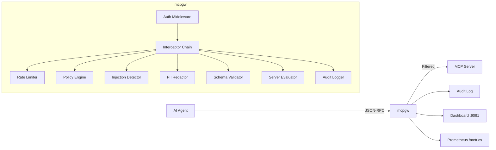

[English](./README.md) | [日本語](./README.ja.md)

# mcpgw

**[Model Context Protocol](https://modelcontextprotocol.io/) (MCP) サーバー向けセキュリティゲートウェイ。**

AI エージェントと MCP サーバー間のすべての JSON-RPC メッセージを傍受し、ポリシー適用・認証・脅威検出・監査ログを実現する — ツールに到達する前にすべてを制御する。

```
AI Agent ──► mcpgw ──► MCP Server
              │
              ├─ 認証 (JWT / API Key / OAuth)
              ├─ ポリシー適用 (allow / deny / audit)
              ├─ プロンプトインジェクション検出
              ├─ PII 自動マスキング
              ├─ レート制限 & サーキットブレーカー
              ├─ サーバーリスク評価
              ├─ 監査ログ (JSONL)
              └─ リアルタイムダッシュボード
```

## なぜ mcpgw が必要か

MCP は AI エージェントに外部ツールの呼び出しを提供する — コマンド実行、データベースクエリ、ファイル読み取り、メール送信。しかし MCP には**組み込みのセキュリティレイヤーがない**。接続されたエージェントは任意のツールを任意の引数で呼び出せてしまう。

mcpgw は透過セキュリティプロキシとしてこの問題を解決する:

- **危険なツール呼び出しをブロック** — `exec_command("rm -rf /")` や `read_file("/etc/shadow")` を glob ベースのポリシーで防止
- **すべてのリクエストを認証** — JWT、API キー、OAuth 2.1 でユーザーごとの ID 追跡
- **プロンプトインジェクション検出** — ヒューリスティック分析でインジェクション試行をツール到達前にキャッチ
- **PII 自動マスキング** — ツール引数とレスポンスの個人情報を自動検出・マスキング
- **レート制限 & サーキットブレーカー** — クライアントごとのトークンバケット制限、upstream 障害時のサーキットブレーカー
- **サーバーリスク評価** — MCP サーバーのツールマニフェストを自動スコアリング（high/medium/low）
- **完全な監査証跡** — 誰が (subject)、何を (tool + args)、どこへ (upstream)、なぜ (allow/block 理由) をすべて記録
- **リアルタイムダッシュボード** — トラフィック監視、脅威分析、監査ログ検索、サーバー承認/拒否

## Quick Start

```bash
go install github.com/knorq-ai/mcpgw@latest

# ゲートウェイを起動
mcpgw proxy --upstream http://localhost:8080 --policy policy.yaml

# Docker で起動
docker run -p 9090:9090 -p 9091:9091 ghcr.io/knorq-ai/mcpgw \
  proxy --upstream http://host.docker.internal:8080
```

### デモを試す

デモは脆弱な MCP サーバー、ゲートウェイを起動し、4 フェーズの攻撃シミュレーションを実行する:

```bash
git clone https://github.com/knorq-ai/mcpgw.git
cd mcpgw
make demo
# ダッシュボード: http://localhost:9091
```

シミュレーションは 3 ユーザーでトラフィックを送信する:
- **alice** — 正常利用（echo, weather, math）→ すべて通過
- **mallory** — 攻撃（exec_command, SQL インジェクション, 環境変数漏洩, フィッシングメール）→ ブロック
- **bob** — バーストトラフィック → レート制限

## アーキテクチャ



2 つの動作モード:

| モード | トランスポート | ユースケース |
|--------|--------------|-------------|
| `mcpgw proxy` | HTTP (Streamable HTTP) | リモート MCP サーバー、本番デプロイ |
| `mcpgw wrap` | stdio | ローカル MCP サーバー、Claude Desktop、開発 |

## 設定

すべてのオプションは CLI フラグ、設定ファイル（`--config`）、環境変数で指定できる。

```yaml
upstream: http://localhost:8080
listen: ":9090"
policy: policy.yaml
audit_log: audit.jsonl

auth:
  api_keys:
    - key: ${API_KEY_AGENT_1}
      name: agent-1
  jwt:
    algorithm: RS256
    jwks_url: https://auth.example.com/.well-known/jwks.json

rate_limit:
  requests_per_second: 100
  burst: 20

circuit_breaker:
  max_failures: 5
  timeout: "30s"

session:
  ttl: "30m"

metrics:
  addr: ":9091"

server_eval:
  enabled: true
  mode: enforce          # "enforce" or "audit"
  auto_approve:
    risk_levels: ["low"]

plugins:
  - name: pii
    config:
      mode: redact       # "detect" or "redact"
  - name: injection
    config:
      threshold: 0.7
  - name: schema
    config:
      strict: true

routing:
  routes:
    - match: ["exec_*", "run_*"]
      upstream: http://sandboxed-server:8080
    - match: ["*"]
      upstream: http://default-server:8080
```

## ポリシー

ポリシーは YAML ファイルで定義し、first-match-wins で評価される。どのルールにもマッチしないリクエストは拒否される。

```yaml
version: v1
mode: enforce   # "enforce" or "audit"（ログのみ）
rules:
  # 管理者は全ツール実行可能
  - name: admin-full-access
    match:
      methods: ["tools/call"]
      subjects: ["admin-*"]
    action: allow

  # 危険なコマンドをブロック
  - name: block-dangerous-exec
    match:
      methods: ["tools/call"]
      tools: ["exec_*"]
      args:
        command: ["*rm *", "*sudo*", "*chmod*"]
    action: deny

  # 機密ファイルの読み取りをブロック
  - name: block-sensitive-files
    match:
      methods: ["tools/call"]
      tools: ["read_file"]
      args:
        path: ["/etc/*", "*.env", "*.pem", "*.key"]
    action: deny

  # その他はすべて許可
  - name: default-allow
    match:
      methods: ["*"]
    action: allow
```

ルールはメソッド、ツール名、サブジェクト、引数値の glob パターンに対応。サーバーを起動せずに検証:

```bash
mcpgw policy validate policy.yaml
```

`SIGHUP` でホットリロード — ダウンタイムなし:

```bash
kill -HUP $(pgrep mcpgw)
```

## ビルトインプラグイン

| プラグイン | 説明 |
|-----------|------|
| **pii** | ツール引数とレスポンスの PII（メール、電話番号、SSN 等）を検出またはマスキング |
| **injection** | ヒューリスティックベースのプロンプトインジェクション検出（感度設定可能） |
| **schema** | `tools/list` の JSON スキーマに対してツール引数をバリデーション |

プラグインは interceptor chain 内で実行され、client-to-server と server-to-client の両方向を処理する。

## サーバー評価

新しい MCP サーバーが接続されると、mcpgw はツールマニフェストを評価しリスクスコアを付与する:

| リスクレベル | ツールパターン | スコア |
|-------------|--------------|--------|
| **High** | `exec_*`, `run_*`, `send_*`, `delete_*`, `write_*`, `sql_*` | 0.9 |
| **Medium** | `read_file`, `get_env`, `list_*` | 0.5 |
| **Low** | その他すべて | 0.2 |

`enforce` モードでは、高リスクサーバーはダッシュボードで手動承認されるまでブロックされる。`audit` モードでは通過するがレビュー用に記録される。

## ダッシュボード

管理サーバー（`metrics.addr`）はリアルタイムダッシュボードを提供する:

| ページ | 説明 |
|--------|------|
| **Overview** | リクエスト数、ブロック率、アクティブセッション、レイテンシ |
| **Audit Log** | subject、upstream、tool、action フィルタ付き検索可能ログ |
| **Policies** | ポリシールールの表示とテスト |
| **Servers** | リスクスコア付きの評価済みサーバー、承認/拒否アクション |
| **Analytics** | サーバー/ユーザー/ツール/脅威別の集計統計 |
| **Status** | ヘルス、サーキットブレーカー状態、upstream 到達性 |

API エンドポイント: `/api/audit`, `/api/status`, `/api/servers`, `/api/analytics/*`, `/api/policy`

## 可観測性

- **監査ログ** — JSONL 形式（timestamp, direction, method, tool, args, action, reason, subject, upstream, request_id）
- **Prometheus メトリクス** — `mcpgw_requests_total`, `mcpgw_request_duration_seconds`, `mcpgw_active_sessions`, `mcpgw_server_evaluations_total` 等
- **ヘルスエンドポイント** — `/healthz`（liveness）、`/readyz`（upstream 到達性）
- **Webhook アラート** — ポリシー違反時のリアルタイム通知

## CLI リファレンス

| コマンド | 説明 |
|---------|------|
| `mcpgw proxy` | HTTP リバースプロキシを起動 |
| `mcpgw wrap -- <cmd> [args]` | 子プロセスをラップする stdio プロキシを起動 |
| `mcpgw policy validate <file>` | ポリシー YAML ファイルを検証 |
| `mcpgw version` | バージョンを表示 |

主要な `proxy` フラグ:

```
--upstream       upstream MCP サーバーの URL
--listen         リッスンアドレス（デフォルト: :9090）
--policy         ポリシー YAML ファイルパス
--audit-log      監査ログパス（デフォルト: ~/.mcpgw/audit.jsonl）
--config         設定ファイルパス
--tls-cert       TLS 証明書ファイル
--tls-key        TLS 秘密鍵ファイル
--auth-apikeys   カンマ区切りの API キー
```

## コントリビューション

コントリビューションを歓迎する。変更内容について先に Issue を作成してほしい。

```bash
make test     # レース検出付きテスト実行
make build    # フロントエンド + Go バイナリをビルド
make demo     # フルデモを実行
```

## License

[Apache License 2.0](LICENSE)
