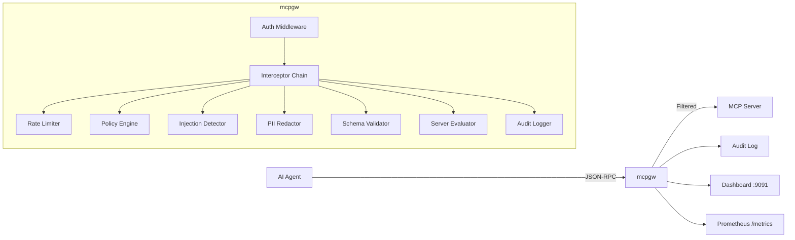

[English](./README.md) | [日本語](./README.ja.md)

# mcpgw

**Security gateway for [Model Context Protocol](https://modelcontextprotocol.io/) (MCP) servers.**

Intercepts every JSON-RPC message between AI agents and MCP servers to enforce policies, authenticate requests, detect threats, and produce audit logs — before anything reaches your tools.

```
AI Agent ──► mcpgw ──► MCP Server
              │
              ├─ Authentication (JWT / API Key / OAuth)
              ├─ Policy enforcement (allow / deny / audit)
              ├─ Prompt injection detection
              ├─ PII redaction
              ├─ Rate limiting & circuit breaker
              ├─ Server risk evaluation
              ├─ Audit logging (JSONL)
              └─ Real-time dashboard
```

## Why mcpgw?

MCP lets AI agents call external tools — execute commands, query databases, read files, send emails. But MCP has **no built-in security layer**. Any connected agent can call any tool with any arguments.

mcpgw solves this by acting as a transparent security proxy:

- **Block dangerous tool calls** — Prevent `exec_command("rm -rf /")` or `read_file("/etc/shadow")` with glob-based policy rules
- **Authenticate every request** — JWT, API keys, or OAuth 2.1 with per-user identity tracking
- **Detect prompt injection** — Heuristic analysis catches injection attempts before they reach tools
- **Redact PII** — Automatically detect and redact sensitive data in tool arguments and responses
- **Rate limit & circuit break** — Token bucket rate limiting per client, circuit breaker for upstream failures
- **Evaluate server risk** — Automatically score MCP servers by their tool manifests (high/medium/low risk)
- **Full audit trail** — Every request logged with who (subject), what (tool + args), where (upstream), and why (allow/block reason)
- **Real-time dashboard** — Monitor traffic, analyze threats, review audit logs, approve/deny servers

## Quick Start

```bash
go install github.com/knorq-ai/mcpgw@latest

# Start the gateway
mcpgw proxy --upstream http://localhost:8080 --policy policy.yaml

# Or use Docker
docker run -p 9090:9090 -p 9091:9091 ghcr.io/knorq-ai/mcpgw \
  proxy --upstream http://host.docker.internal:8080
```

### Try the Demo

The demo starts a vulnerable MCP server, the gateway, and runs a 4-phase attack simulation:

```bash
git clone https://github.com/knorq-ai/mcpgw.git
cd mcpgw
make demo
# Open http://localhost:9091 for the dashboard
```

The simulation sends traffic as 3 users:
- **alice** — Normal usage (echo, weather, math) → all pass
- **mallory** — Attacks (exec_command, SQL injection, env leaks, phishing emails) → blocked
- **bob** — Burst traffic → rate limited

## Architecture



Two operating modes:

| Mode | Transport | Use Case |
|------|-----------|----------|
| `mcpgw proxy` | HTTP (Streamable HTTP) | Remote MCP servers, production deployments |
| `mcpgw wrap` | stdio | Local MCP servers, Claude Desktop, development |

## Configuration

All options can be set via CLI flags, config file (`--config`), or environment variables.

```yaml
upstream: http://localhost:8080
listen: ":9090"
policy: policy.yaml
audit_log: audit.jsonl

auth:
  api_keys:
    - key: ${API_KEY_AGENT_1}
      name: agent-1
  jwt:
    algorithm: RS256
    jwks_url: https://auth.example.com/.well-known/jwks.json

rate_limit:
  requests_per_second: 100
  burst: 20

circuit_breaker:
  max_failures: 5
  timeout: "30s"

session:
  ttl: "30m"

metrics:
  addr: ":9091"

server_eval:
  enabled: true
  mode: enforce          # "enforce" or "audit"
  auto_approve:
    risk_levels: ["low"]

plugins:
  - name: pii
    config:
      mode: redact       # "detect" or "redact"
  - name: injection
    config:
      threshold: 0.7
  - name: schema
    config:
      strict: true

routing:
  routes:
    - match: ["exec_*", "run_*"]
      upstream: http://sandboxed-server:8080
    - match: ["*"]
      upstream: http://default-server:8080
```

## Policy

Policies are YAML files evaluated in first-match-wins order. Unmatched requests are denied.

```yaml
version: v1
mode: enforce   # "enforce" or "audit" (log-only)
rules:
  # Allow admins to run any tool
  - name: admin-full-access
    match:
      methods: ["tools/call"]
      subjects: ["admin-*"]
    action: allow

  # Block dangerous commands for everyone else
  - name: block-dangerous-exec
    match:
      methods: ["tools/call"]
      tools: ["exec_*"]
      args:
        command: ["*rm *", "*sudo*", "*chmod*"]
    action: deny

  # Block sensitive file reads
  - name: block-sensitive-files
    match:
      methods: ["tools/call"]
      tools: ["read_file"]
      args:
        path: ["/etc/*", "*.env", "*.pem", "*.key"]
    action: deny

  # Allow everything else
  - name: default-allow
    match:
      methods: ["*"]
    action: allow
```

Rules support glob patterns for methods, tools, subjects, and argument values. Validate without starting the server:

```bash
mcpgw policy validate policy.yaml
```

Hot reload on `SIGHUP` — zero downtime:

```bash
kill -HUP $(pgrep mcpgw)
```

## Built-in Plugins

| Plugin | Description |
|--------|-------------|
| **pii** | Detect or redact PII (emails, phone numbers, SSNs) in tool arguments and responses |
| **injection** | Heuristic prompt injection detection with configurable sensitivity |
| **schema** | Validate tool arguments against JSON schemas from `tools/list` |

Plugins run as interceptors in the chain — both client-to-server and server-to-client directions.

## Server Evaluation

When a new MCP server connects, mcpgw evaluates its tool manifest and assigns a risk score:

| Risk Level | Tool Patterns | Score |
|------------|--------------|-------|
| **High** | `exec_*`, `run_*`, `send_*`, `delete_*`, `write_*`, `sql_*` | 0.9 |
| **Medium** | `read_file`, `get_env`, `list_*` | 0.5 |
| **Low** | Everything else | 0.2 |

In `enforce` mode, high-risk servers are blocked until manually approved via the dashboard. In `audit` mode, they pass but are logged for review.

## Dashboard

The management server (`metrics.addr`) serves a real-time dashboard:

| Page | Description |
|------|-------------|
| **Overview** | Request counts, block rate, active sessions, latency |
| **Audit Log** | Searchable log with subject, upstream, tool, action filters |
| **Policies** | View and test policy rules |
| **Servers** | Evaluated servers with risk scores, approve/deny actions |
| **Analytics** | Aggregated stats by server, user, tool, or threat type |
| **Status** | Health, circuit breaker state, upstream readiness |

API endpoints: `/api/audit`, `/api/status`, `/api/servers`, `/api/analytics/*`, `/api/policy`

## Observability

- **Audit log** — JSONL with timestamp, direction, method, tool, args, action, reason, subject, upstream, request_id
- **Prometheus metrics** — `mcpgw_requests_total`, `mcpgw_request_duration_seconds`, `mcpgw_active_sessions`, `mcpgw_server_evaluations_total`, etc.
- **Health endpoints** — `/healthz` (liveness), `/readyz` (upstream reachability)
- **Webhook alerts** — Real-time notifications on policy violations

## CLI Reference

| Command | Description |
|---------|-------------|
| `mcpgw proxy` | Start HTTP reverse proxy |
| `mcpgw wrap -- <cmd> [args]` | Start stdio proxy wrapping a child process |
| `mcpgw policy validate <file>` | Validate a policy YAML file |
| `mcpgw version` | Print version |

Key `proxy` flags:

```
--upstream       Upstream MCP server URL
--listen         Listen address (default: :9090)
--policy         Policy YAML file path
--audit-log      Audit log path (default: ~/.mcpgw/audit.jsonl)
--config         Config file path
--tls-cert       TLS certificate file
--tls-key        TLS private key file
--auth-apikeys   Comma-separated API keys
```

## Contributing

Contributions are welcome. Please open an issue first to discuss what you want to change.

```bash
make test     # Run tests with race detection
make build    # Build frontend + Go binary
make demo     # Run the full demo
```

## License

[Apache License 2.0](LICENSE)
